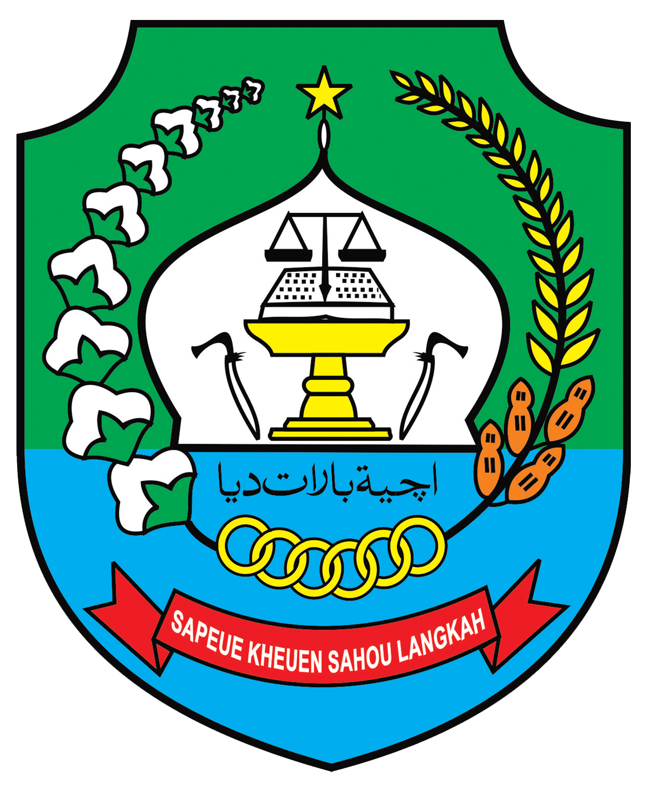
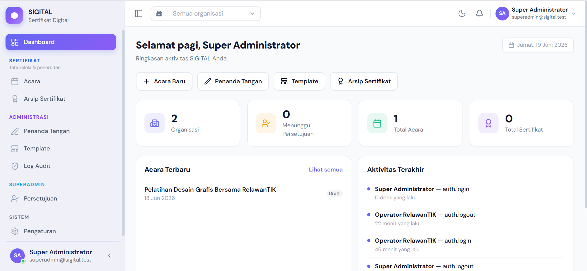

<div align="center">



# SIGITAL — Sertifikat Digital

### Layanan Penerbitan Sertifikat Digital Pemerintah Kabupaten Aceh Barat Daya

Dibangun oleh **Dinas Komunikasi, Informatika, Statistik, dan Persandian (Diskominsa) Aceh Barat Daya**

Tahun Pembuatan: **2026**

[](https://laravel.com)
[](https://vuejs.org)
[](https://tailwindcss.com)
[](https://typescriptlang.org)
[](https://inertiajs.com)

</div>

---

## Preview

<p align="center">
  
</p>

---

## Tentang

**SIGITAL** adalah aplikasi penerbitan dan pengelolaan sertifikat digital milik **Pemerintah Kabupaten Aceh Barat Daya**, dikembangkan dan dikelola oleh **Diskominsa Aceh Barat Daya**.

Aplikasi ini memungkinkan instansi di lingkungan Pemkab Aceh Barat Daya untuk membuat acara/kegiatan, mengelola peserta, menetapkan penanda tangan, serta menerbitkan sertifikat digital dengan penomoran yang aman dan dapat diverifikasi.

Dibangun di atas stack Laravel + Inertia.js + Vue 3 + TailwindCSS v4 dengan TypeScript strict mode.

---

## Tech Stack

| Layer | Technology | Version |
|---|---|---|
| Backend | Laravel | 13.x |
| Frontend Bridge | Inertia.js | 3.x |
| UI Framework | Vue 3 (Composition API) | 3.5.x |
| Language | TypeScript (strict mode) | 5.x |
| Styling | TailwindCSS v4 (CSS-first) | 4.x |
| Build Tool | Vite | 8.x |
| Icons | @lucide/vue (tree-shakeable) | 1.x |
| Charts | Chart.js + vue-chartjs | 4.x |
| Fonts | DM Sans Variable, JetBrains Mono, Geist | — |

---

## Fitur Utama

- **Manajemen Acara** — buat & kelola acara/kegiatan beserta kolaborator (event member + join code)
- **Manajemen Peserta** — input manual atau impor massal, pelacakan status sertifikat
- **Penanda Tangan (Signatory)** — kelola penanda tangan resmi, cegah duplikasi
- **Penerbitan Sertifikat** — render PDF dengan template & branding instansi, penomoran aman & sulit ditebak
- **Template & Branding** — kustomisasi tampilan sertifikat per organisasi
- **Multi-Organisasi (Tenancy)** — pemisahan data antar instansi, switcher untuk SuperAdmin
- **Keamanan Akun** — verifikasi OTP via WhatsApp saat registrasi, Two-Factor Authentication (2FA)
- **Notifikasi** — notifikasi internal (registrasi, persetujuan akun, acara, permintaan bergabung)
- **Audit Log** — pencatatan aktivitas penting
- **Dark Mode** — class-based, persisten via `localStorage`

---

## Halaman Legal & Ketentuan Layanan

SIGITAL menyediakan halaman informasi hukum yang wajib disetujui/diketahui pengguna:

| Halaman | Deskripsi |
|---|---|
| **Syarat dan Ketentuan Layanan** | Ketentuan penggunaan layanan SIGITAL, hak & kewajiban pengguna, batasan tanggung jawab Pemkab Aceh Barat Daya, serta aturan penerbitan dan keabsahan sertifikat digital. |
| **Kebijakan Privasi** | Penjelasan jenis data pribadi yang dikumpulkan (identitas, nomor telepon, dsb.), tujuan penggunaan, dasar pemrosesan, penyimpanan, dan hak pengguna atas datanya, sesuai peraturan perlindungan data yang berlaku. |
| **Pemberitahuan Cookie (Cookie Concern)** | Informasi penggunaan cookie/penyimpanan lokal (sesi login, preferensi tema, dsb.), jenis cookie yang dipakai, dan cara pengguna mengelola persetujuannya. |

> Konten halaman legal dikelola oleh Diskominsa Aceh Barat Daya dan dapat diperbarui sewaktu-waktu mengikuti regulasi yang berlaku.

---

## Instalasi

### Requirements
- PHP 8.2+
- Node.js 20+
- Composer 2.x

### Setup

```bash
# Clone repository
git clone https://github.com/ziaulkamal/sigital.git
cd sigital

# Install dependencies
composer install
npm install

# Konfigurasi environment
cp .env.example .env
php artisan key:generate
php artisan migrate

# Jalankan development server
php artisan serve

# Di terminal terpisah
npm run dev
```

### Production Build

```bash
npm run build
```

---

## Lisensi

Hak cipta dan hak penggunaan aplikasi ini dimiliki oleh **Pemerintah Kabupaten Aceh Barat Daya**. Penggunaan, distribusi, dan modifikasi di luar lingkungan resmi Pemkab Aceh Barat Daya harus dengan izin tertulis dari Diskominsa Aceh Barat Daya.

---

<div align="center">


**SIGITAL — Sertifikat Digital**

Dibuat oleh **Diskominsa Aceh Barat Daya** &nbsp;·&nbsp; © 2026 Pemerintah Kabupaten Aceh Barat Daya

</div>
